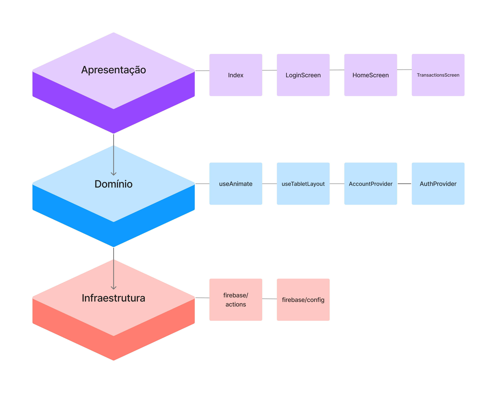

# 📱 Lumen Financial - Mobile

> Projeto desenvolvido como parte do Tech Challenge (Fase 4). Nesta fase, o desafio é evoluir a aplicação de gerenciamento financeiro desenvolvida na fase anterior ([Fase 3](https://github.com/MQ-J/tech-challenge-financeiro-terceira-fase)), incorporando os novos conceitos aprendidos, como padrões avançados de arquitetura front-end e Clean Architecture.

---

## Tech Challenge - Fase 4: Requisitos do desafio

### Refatoração e Melhoria da Arquitetura

- [X] Aplicar padrões de arquitetura modular para uma melhor organização 
do código.
- [X] Implementar State Management Patterns avançados para otimizar o gerenciamento do estado da aplicação.
- [X] Separar as camadas de apresentação, domínio e infraestrutura, 
seguindo os princípios da Clean Architecture.

### Performance e Otimização

- [X] Melhorar o tempo de carregamento da aplicação aplicando estratégias 
de lazy loading e pré-carregamento.
- [X] Utilizar técnicas de Programação Reativa para tornar a interface mais 
responsiva e eficiente.

### Tecnologias e conceitos a serem utilizados

#### Arquitetura Front-end Moderna

- [X] melhoria na organização do código 
seguindo Clean Architecture.

---

### Material para a entrega

- [X] Link do repositório Git do projeto.
- [X] README contendo as tecnologias utilizadas e o passo a passo para rodar a aplicação localmente.
- [X] Um vídeo de até 5 (cinco) minutos demonstrando as principais 
funcionalidades.

---

## 🧱 Arquitetura em cadmadas


## ✨ Melhorias implementadas

### 🌊 useAnimate
Hook para agrupar a responsabilidade pelas animações da aplicação. 

- A animações ocorrem após os dados do usuário em `account` serem definidos.
- As animações da opacidade e eixo Y rodam em paralelo, com um delay de **100ms**.

### 📱 useTabletLayout
Hook responsável por definir a regra de layout em tablets.

### ⚙️ firebase/actions
Funções responsáveis pela conexão com o banco utilizado. Neste caso, o Firebase.

- **signOutSection:** Realiza o encerramento da sessão do usuário autenticado.
- **onAuthStateChangedListener:** Monitora alterações no estado de autenticação do usuário.
- **conectionErrorMessage:** Converte erros de autenticação em mensagens amigáveis para exibição ao usuário.

### 🛑 useDeferredMount
Útil para adiar a montagem de componentes pesados para após o primeiro frame visível, melhorando o tempo de resposta inicial.

## 🔗 Acesso rápido (ambiente local)

Após iniciar o projeto (veja **Getting Started** abaixo):

| Plataforma | Comando / URL | Descrição |
| :--- | :--- | :--- |
| **📱 Expo Go** | `npx expo start` e escanear QR code | App no dispositivo físico. **Use a mesma rede Wi‑Fi do PC** (modo LAN); em dados móveis o QR costuma apontar para um IP local inacessível. Alternativa: `npx expo start --tunnel`. |
| **🌐 Web** | `npx expo start --web` → `http://localhost:8081` | Versão web (React Native Web). |
| **🤖 Android** | `npx expo start --android` | Emulador ou dispositivo Android. |
| **🍎 iOS** | `npx expo start --ios` | Simulador ou dispositivo iOS (macOS). |

---

## 🛠 Tecnologias utilizadas

| Área | Tecnologias |
| :--- | :--- |
| **Core** | React 19, React Native 0.81, Expo SDK 54 |
| **Linguagem** | TypeScript 5 |
| **Navegação** | Expo Router 6, React Navigation 7 (`@react-navigation/native`, bottom tabs) |
| **Animações (dashboard)** | React Native `Animated` + `useNativeDriver`; foco de aba com `useIsFocused` (`@react-navigation/native`) |
| **Formulários e validação** | React Hook Form, Zod, @hookform/resolvers |
| **Estado** | Context API (AccountContext) |
| **Backend / cloud** | **Firebase** (`firebase` SDK: Auth, Firestore, Storage) |
| **Segurança / local** | expo-secure-store, crypto-js (storage local); `react-native-bcrypt` em utilitários legados |
| **UI e feedback** | expo-linear-gradient, react-native-toast-message, @expo/vector-icons, react-native-svg, react-native-gifted-charts |
| **Layout** | React Native StyleSheet, breakpoint tablet (constants/layout), `react-native-safe-area-context` (SafeAreaProvider / SafeAreaView / insets) |
| **Outras libs RN (Expo)** | `react-native-reanimated` (stack Expo; animações do dashboard usam `Animated` nativo) |

---

## 🚀 Getting Started – Como executar o projeto

### Pré-requisitos

- Node.js >= 18
- npm >= 8
- [Expo Go](https://expo.dev/go) instalado no celular (para testar no dispositivo) ou emulador Android/iOS

### Instalação e execução

```bash
# Clone o repositório (se ainda não tiver)
git clone <url-do-repositorio>

# Instalar dependências
npm install

# Iniciar o app (Expo)
npx expo start
```

Utilize o QR code no terminal para abrir no **Expo Go** ou as teclas do CLI para abrir em **web**, **Android** ou **iOS**.

### Firebase (obrigatório para login, transações e recibos)

1. Crie um projeto no [Firebase Console](https://console.firebase.google.com/) e ative **Authentication** (e-mail/senha), **Firestore** e **Storage**.
2. Copie as chaves do SDK para `firebase/config.ts` (ou use variáveis `EXPO_PUBLIC_*` se o grupo adotar `.env`).
3. Publique as **regras do Storage** conforme o arquivo `firebase/storage.rules` (Console → Storage → Rules).
4. Configure **regras do Firestore** (perfil `users/{uid}` e subcoleção `accounts/{accountId}/transactions`) — exemplo no guia abaixo.

**Guia passo a passo (Console, modelo de dados, arquivos `lib/` e regras):**  
[Documentação Firebase](docs/firebase.md)

---

## 📂 Estrutura do projeto

Formato enxuto, no estilo do desafio:

```text
tech-challenge-financeiro-quarta-fase/
├── docs/
│   └── firebase.md                           # Documentação Firebase, Firestore/Storage, guias de configuração
├── firebase/
│   ├── config.ts                             # initializeApp + Auth (web vs native com AsyncStorage persistence)
│   ├── actions.ts                            # Funções Firebase Auth (login, logout, listeners, sign-out)
│   └── storage.rules                         # Regras Storage (estrutura e permissões de acesso)
├── app/                                      # Rotas (Expo Router)
│   ├── _layout.tsx                           # Layout raiz (Stack, AccountProvider, AuthProvider, Toast)
│   ├── index.tsx                             # Redireciona para login ou (tabs) conforme auth
│   ├── +not-found.tsx                        # Página 404
│   ├── (auth)/                               # Grupo de rotas não autenticadas
│   │   ├── _layout.tsx                       # Stack sem header (auth group)
│   │   └── login.tsx                         # Tela de login + modais (Entrar / Abrir conta)
│   └── (tabs)/                               # Grupo de rotas autenticadas
│       ├── _layout.tsx                       # Bottom tabs (Dashboard, Transações)
│       ├── index.tsx                         # Home pós-login (Dashboard com saldo)
│       └── transacoes.tsx                    # Listagem, filtros e criação de transações
├── components/                               # Componentes reutilizáveis
│   ├── BalanceCard.tsx                       # Card de saldo/balanço
│   ├── Greeting.tsx                          # Saudação personalizadas (ex: "Olá, Nome")
│   ├── InfosCard.tsx                         # Card de informações (benefícios, dicas na login)
│   ├── Checkbox.tsx                          # Checkbox customizado (termos, aceitar)
│   ├── TextInputField.tsx                    # Input reutilizável com ícone e validação
│   ├── PrimaryButton.tsx                     # Botão primário/outline
│   ├── LoginForm.tsx                         # Formulário login
│   ├── RegisterForm.tsx                      # Formulário cadastro/registro
│   ├── TransactionForm.tsx                   # Formulário criação/edição de transação
│   ├── TransactionsList.tsx                  # Lista completa de transações com filtros e paginação (10/página)
│   ├── RecentTransactions.tsx                # Widget de transações recentes (resumo)
│   ├── RecentTransactionRow.tsx              # Linha individual de transação no widget
│   └── charts/
│       ├── ChartsNative.tsx                  # Wrapper/container para gráficos
│       ├── BarChartTransactionsNative.tsx    # Gráfico de barras (transações por período)
│       └── PieChartExpensesNative.tsx        # Gráfico de pizza (despesas por categoria)
├── contexts/
│   ├── AccountContext.tsx                    # Estado da conta (saldo, transações, CRUD transações)
│   │                                         # Sincroniza Firestore + Storage (metadados locais)
│   └── AuthContext.tsx                       # Firebase Auth (login, cadastro) + perfil Firestore
├── lib/
│   ├── firebase.ts                           # getFirestore + getStorage (compartilha config.ts)
│   ├── firestore.ts                          # CRUD transações subcoleção + sync users/{uid}
│   ├── user-account-from-firestore.ts        # Fetch e mapeamento perfil Firestore → Account
│   ├── receipt-storage.ts                    # Upload/delete recibos no Firebase Storage
│   ├── storage.ts                            # SecureStore + fallback web (metadados transações)
│   ├── types.ts                              # Types: Account, Transaction, TransactionType, FirestoreUserProfile
│   ├── auth.ts                               # Utilitários bcrypt (legacy)
│   ├── firebase-auth-messages.ts             # Mapeamento mensagens erro Firebase Auth (PT-BR)
│   ├── format.ts                             # Formatadores (moeda, data, etc)
│   ├── transaction-schema.ts                 # Validação Zod para transações
│   └── chartData.ts                          # Processamento dados para gráficos
├── constants/
│   └── layout.ts                             # TABLET_BREAKPOINT, MAX_CONTENT_WIDTH, FOOTER_HEIGHT
├── hooks/
│   ├── useAnimate.ts                         # Hook animações (Animated API)
│   ├── useDeferredMount.ts                   # Aguarda hydration antes renderizar
│   └── useTabletLayout.ts                    # Detecta layout tablet vs mobile
├── assets/
│   └── images/                               # Imagens, ícones, recursos estáticos
├── theme/
│   └── colors.ts                             # Paleta de cores (tema)
├── app.json                                  # Configuração Expo (nome, versão, plugins)
├── expo-env.d.ts                             # Type definitions Expo environment
├── tsconfig.json                             # TypeScript config
├── eslint.config.js                          # ESLint rules
├── package.json                              # Dependências (React Native, Firebase, Zod, RHF, etc)
└── README.md                                 # Documentação do projeto
```

---

## 📜 Scripts Disponíveis

### Aplicação (Expo)
```bash
npm run start     # Inicia o Expo (npx expo start)
npm run android   # Inicia e abre no emulador/dispositivo Android
npm run ios       # Inicia e abre no simulador/dispositivo iOS
npm run web       # Inicia e abre no navegador (atalho para npx expo start --web)
npm run lint      # Executa linting (expo lint)
npx expo start -c # Inicia o Expo limpando o cache (útil para resolver problemas de build/cache)
```
